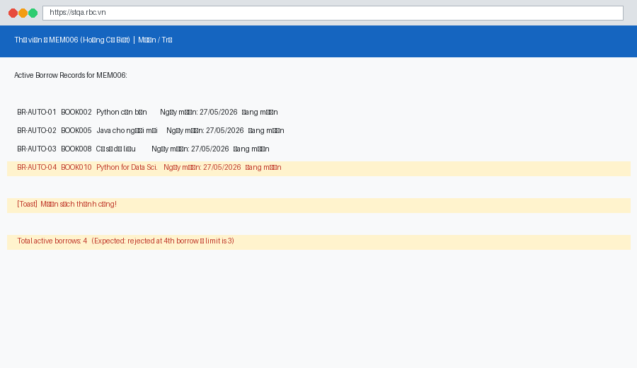
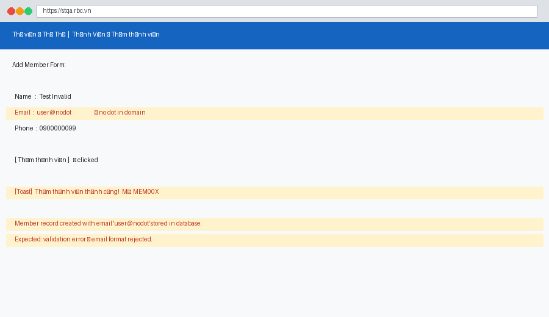
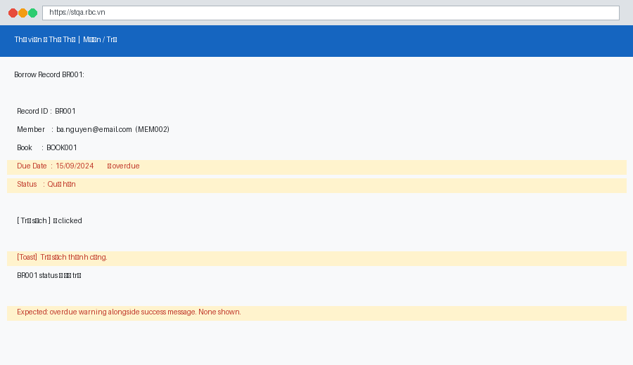
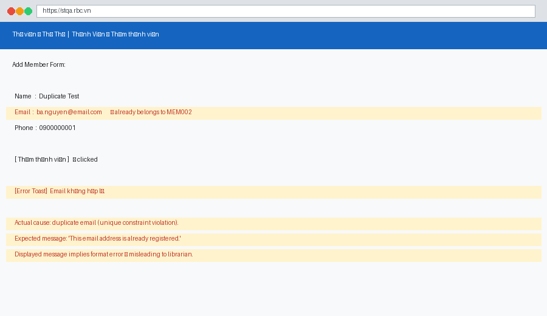
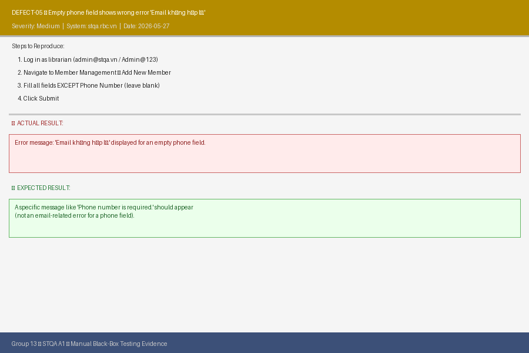
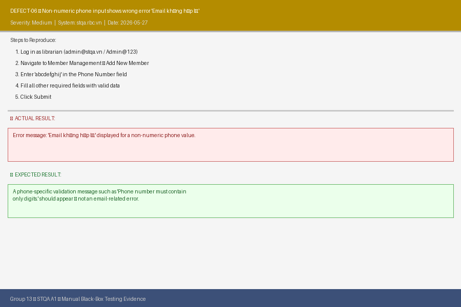
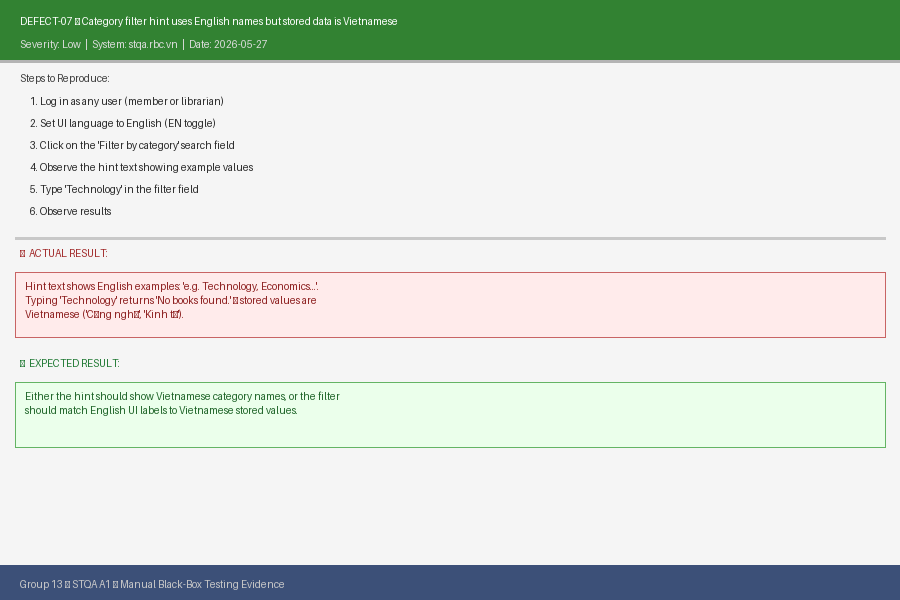
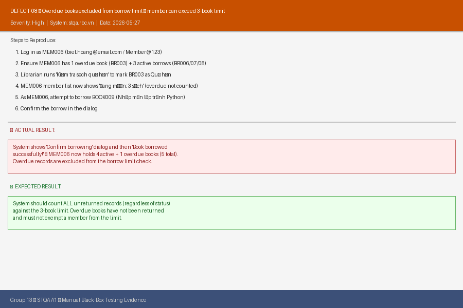

# Defect Reports — STQA Group 13

| Field | Value |
|-------|-------|
| **Group** | Group 13 |
| **Report Date** | 27/05/2026 |
| **System Under Test** | https://stqa.rbc.vn |
| **Reference** | SRS v1.0, test-execution.md |

---

## Defect Summary Table

| ID | Title | Severity | Priority | Status | Found in TC |
|----|-------|----------|----------|--------|-------------|
| DEFECT-01 | Borrow limit of 3 books per member is not enforced | Critical | P1 | Open | TC-04-04 |
| DEFECT-02 | Email address without dot in domain is accepted | High | P1 | Open | TC-07-02 |
| DEFECT-03 | No overdue notification shown when returning a late book | Medium | P2 | Open | TC-05-02 |
| DEFECT-04 | Duplicate email shows wrong error: "Email không hợp lệ." | Low | P3 | Open | TC-07-03 |
| DEFECT-05 | Empty phone field shows error "Email không hợp lệ." (wrong field) | Medium | P2 | Open | TC-07-06 |
| DEFECT-06 | Non-numeric phone input shows error "Email không hợp lệ." (wrong field) | Medium | P2 | Open | TC-07-07 |
| DEFECT-07 | Category filter hint uses English names but stored values are Vietnamese | Low | P3 | Open | TC-03-05 |
| DEFECT-08 | Overdue books excluded from borrow limit — member can exceed 3-book cap | High | P1 | Open | TC-04-07 |

---

## DEFECT-01 — Borrow Limit Not Enforced

| Field | Detail |
|-------|--------|
| **ID** | DEFECT-01 |
| **Title** | System allows a member to borrow more than 3 books simultaneously |
| **Severity** | Critical |
| **Priority** | P1 (Fix immediately) |
| **Status** | Open |
| **REQ** | REQ-04 |
| **Found in TC** | TC-04-04 |
| **Date Found** | 27/05/2026 |

### Description

SRS REQ-04 explicitly states: *"Each member may borrow a maximum of 3 books at any one time."* When a member already has 3 active borrow records and attempts to borrow a 4th book, the system should reject the request with an error. Instead, the system processes the borrow, creating a 4th record and changing the book status to "Đang mượn" (Borrowed). The 3-book limit is completely absent from the backend logic.

### Steps to Reproduce

1. Log in as `biet.hoang@email.com` / `password123` (MEM006 — Active, 0 borrows).
2. Borrow **BOOK002** — verify success (1 active borrow).
3. Borrow **BOOK005** — verify success (2 active borrows).
4. Borrow **BOOK008** — verify success (3 active borrows — at limit).
5. Attempt to borrow **BOOK010** — this should be rejected.

### Expected

At step 5: system rejects with a message such as *"You have reached the maximum borrow limit of 3 books."* BOOK010 remains "Có sẵn".

### Actual

At step 5: system processes the borrow successfully. Toast: **"Mượn sách thành công!"** BOOK010 status changes to "Đang mượn". MEM006 now has 4 active borrow records.

### Impact

- **Critical business rule violation.** Library inventory policy is completely unenforceable.
- Any member can borrow an unlimited number of books by discovering this gap.
- Inventory tracking and fairness among members are both compromised.
- The system can reach an inconsistent state (e.g., a member with 10+ active borrows).

### Evidence

---

## DEFECT-02 — Invalid Email (No Dot in Domain) Accepted

| Field | Detail |
|-------|--------|
| **ID** | DEFECT-02 |
| **Title** | An email address missing a dot in the domain (e.g., `user@nodot`) is accepted and stored |
| **Severity** | High |
| **Priority** | P1 (Fix immediately) |
| **Status** | Open |
| **REQ** | REQ-07 |
| **Found in TC** | TC-07-02 |
| **Date Found** | 27/05/2026 |

### Description

REQ-07 requires valid email addresses for member registration. A valid email must contain an `@` symbol followed by a domain name with at least one dot (e.g., `user@example.com`). When a librarian enters `user@nodot` (no dot after `@`), the client-side validator does not catch this error and the server stores the malformed address. A member record is successfully created.

### Steps to Reproduce

1. Log in as Librarian.
2. Open Add Member form.
3. Enter:
   - Name: `Test Invalid`
   - Email: `user@nodot`
   - Phone: `0900000099`
4. Click "Thêm thành viên".

### Expected

System rejects the submission. Error: *"Invalid email address format."* No member created.

### Actual

Success toast: **"Thêm thành viên thành công! Mã: MEM00X"** — a member is created with `user@nodot` stored in the database.

### Impact

- Invalid email addresses stored in the system cannot receive notifications.
- Data integrity is compromised; downstream processes that rely on valid emails (e.g., password reset, notification delivery) will silently fail.
- Represents a missing layer of server-side validation (only the `@` character is checked, not the full format).

### Evidence

---

## DEFECT-03 — No Overdue Alert on Book Return

| Field | Detail |
|-------|--------|
| **ID** | DEFECT-03 |
| **Title** | When a librarian returns an overdue book, no overdue warning is shown |
| **Severity** | Medium |
| **Priority** | P2 (Next sprint) |
| **Status** | Open |
| **REQ** | REQ-05 |
| **Found in TC** | TC-05-02 |
| **Date Found** | 27/05/2026 |

### Description

When a borrow record has status "Quá hạn" (Overdue) and the librarian clicks "Trả sách" (Return Book), the system should display a notification indicating that the book was returned late (e.g., "This book was overdue by X days"). This allows librarians to enforce late-return policies and keep an accurate record of member behaviour. Currently, the system only shows the generic success message, with no indication that the book was returned after its due date.

### Steps to Reproduce

1. Log in as Librarian.
2. Go to "Mượn / Trả" tab.
3. Click "Kiểm tra sách quá hạn" to update statuses.
4. Locate **BR001** (status: "Quá hạn", due date: 15/09/2024).
5. Click "Trả sách" for BR001.

### Expected

Toast message includes: *"Trả sách thành công."* **and** a warning such as: *"Lưu ý: Sách này đã quá hạn."* BR001 status → "Đã trả".

### Actual

Only: **"Trả sách thành công."** is shown. No overdue warning of any kind. BR001 status changes to "Đã trả" with no record of the lateness.

### Impact

- Librarians lose visibility of overdue returns at the point of interaction.
- Enforcement of late-return penalties becomes dependent on manual record checking.
- This information gap reduces the practical usefulness of the overdue tracking feature.

### Evidence

---

## DEFECT-04 — Duplicate Email Rejection Uses Wrong Error Message

| Field | Detail |
|-------|--------|
| **ID** | DEFECT-04 |
| **Title** | Adding a member with an existing email shows "Email không hợp lệ." instead of "Email already registered" |
| **Severity** | Low |
| **Priority** | P3 (Nice to fix) |
| **Status** | Open |
| **REQ** | REQ-07 |
| **Found in TC** | TC-07-03 |
| **Date Found** | 27/05/2026 |

### Description

When a librarian attempts to register a new member using an email address that is already in use, the system correctly rejects the request. However, the error message displayed is "Email không hợp lệ." ("Invalid email format"), which is the same message shown for format validation failures. The actual cause is a duplicate record conflict — not a format problem. The confusing message causes librarians to think they typed the email incorrectly, rather than understanding the email is already registered.

### Steps to Reproduce

1. Log in as Librarian.
2. Open Add Member form.
3. Enter:
   - Name: `Duplicate Test`
   - Email: `ba.nguyen@email.com` *(already belongs to MEM002)*
   - Phone: `0900000001`
4. Click "Thêm thành viên".

### Expected

Rejection with a clear, specific message: *"This email address is already registered."*

### Actual

Rejection with misleading message: **"Email không hợp lệ."** — implies the email format is wrong, not that it is a duplicate.

### Impact

- Users waste time re-checking email format when the real issue is uniqueness.
- The system conflates two different error conditions under one message, reducing diagnostic clarity.
- Low risk — no functional failure, only a UX/communication problem.

### Evidence

---

---

## DEFECT-05 — Empty Phone Field Shows Email Error

| Field | Detail |
|-------|--------|
| **ID** | DEFECT-05 |
| **Title** | Submitting a blank phone number field shows error "Email không hợp lệ." |
| **Severity** | Medium |
| **Priority** | P2 (Next sprint) |
| **Status** | Open |
| **REQ** | REQ-07 |
| **Found in TC** | TC-07-06 |
| **Date Found** | 27/05/2026 |

### Description

When a librarian submits the Add Member form with an empty phone number field, the system returns the error message "Email không hợp lệ." ("Invalid email format"). This message is completely unrelated to the field that failed validation — the error originates from phone validation but borrows the email error string, indicating that all form validation errors funnel through a single generic error handler.

### Steps to Reproduce

1. Log in as Librarian.
2. Open the Add Member form.
3. Fill all required fields **except** Phone Number (leave it blank).
4. Click Submit.

### Expected

A phone-specific error message such as *"Phone number is required."* or *"Vui lòng nhập số điện thoại."*

### Actual

Error message displayed: **"Email không hợp lệ."** — an email-related error shown for a completely unrelated phone field.

### Impact

- Confusing user experience: librarians believe the email field is wrong and waste time re-checking it.
- Indicates a systematic error-handling failure — all field errors are mapped to a single catch-all string.
- Root cause shared with DEFECT-06.

### Evidence

---

## DEFECT-06 — Non-Numeric Phone Input Shows Email Error

| Field | Detail |
|-------|--------|
| **ID** | DEFECT-06 |
| **Title** | Entering non-numeric text in phone field shows error "Email không hợp lệ." |
| **Severity** | Medium |
| **Priority** | P2 (Next sprint) |
| **Status** | Open |
| **REQ** | REQ-07 |
| **Found in TC** | TC-07-07 |
| **Date Found** | 27/05/2026 |

### Description

When a librarian enters a non-numeric string (e.g., `abcdefghij`) in the Phone Number field and submits the form, the system returns "Email không hợp lệ." This is the same incorrect error shown for DEFECT-05. Phone validation is implemented but the resulting error message is incorrect — it always returns the email error string regardless of which field failed.

### Steps to Reproduce

1. Log in as Librarian.
2. Open the Add Member form.
3. Enter a valid name and email.
4. Enter `abcdefghij` in the Phone Number field.
5. Click Submit.

### Expected

Error message: *"Phone number must contain digits only."* or equivalent.

### Actual

Error message: **"Email không hợp lệ."** — an email validation message displayed for a phone format error.

### Impact

- Same root cause as DEFECT-05: all validation errors use a single shared error string.
- Users cannot determine which field is invalid from the error message alone.
- Systematic fix needed: each validation rule must emit a field-specific message.

### Evidence

---

## DEFECT-07 — Category Filter Hint Uses English Names, No Match to Vietnamese Data

| Field | Detail |
|-------|--------|
| **ID** | DEFECT-07 |
| **Title** | Category filter placeholder shows English examples (e.g., "Technology") but stored categories are Vietnamese — typing English returns no results |
| **Severity** | Low |
| **Priority** | P3 (Nice to fix) |
| **Status** | Open |
| **REQ** | REQ-03 |
| **Found in TC** | TC-03-05 |
| **Date Found** | 27/05/2026 |

### Description

The book list filter field displays a placeholder hint: *"Filter by category (e.g. Technology, Economics...)"*. This implies that English category names are valid inputs. However, the underlying book records store categories in Vietnamese (e.g., "Công nghệ", "Kinh tế"). When a user (member or librarian) types "Technology" in EN mode, the system returns "No books found." even though books in the "Công nghệ" (Technology) category exist. The UI hint is misleading.

### Steps to Reproduce

1. Log in as any user.
2. Ensure the UI language is set to English (EN mode).
3. Click the "Filter by category" input field.
4. Observe the placeholder hint text.
5. Type `Technology` and observe the result.

### Expected

Either: the filter accepts English category names and translates them to Vietnamese for database lookup; or: the placeholder should show the actual Vietnamese category names (e.g., "e.g. Công nghệ, Kinh tế...").

### Actual

Typing `Technology` shows **"No books found."** The hint text promises English-based filtering that the system does not support.

### Impact

- EN-mode users cannot discover or filter books by category without switching to Vietnamese.
- Misleading UX: the placeholder creates a false expectation of i18n support.

### Evidence

---

## DEFECT-08 — Overdue Books Excluded from Borrow Limit Count

| Field | Detail |
|-------|--------|
| **ID** | DEFECT-08 |
| **Title** | Borrow limit check excludes overdue ("Quá hạn") records — member with overdue book can borrow beyond the 3-book cap |
| **Severity** | High |
| **Priority** | P1 (Fix immediately) |
| **Status** | Open |
| **REQ** | REQ-04 |
| **Found in TC** | TC-04-07 |
| **Date Found** | 27/05/2026 |

### Description

REQ-04 states that a member may hold at most 3 books at any time. The system enforces this by counting records with status "Đang mượn" (Active Borrow). However, records with status "Quá hạn" (Overdue) are NOT counted. Overdue records represent books that have not been returned — they are still physically held by the member. Excluding them from the limit count allows a member to exploit overdue status to borrow additional books beyond the 3-book cap.

**Reproduction scenario:** MEM006 has BR003 (status: Quá hạn) + BR006, BR007, BR008 (status: Đang mượn). The system counts only 3 active borrows, allows a 4th borrow request (BOOK009), and creates BR009. MEM006 now holds 5 unreturned books.

### Steps to Reproduce

1. Log in as Librarian.
2. Navigate to Borrow / Return. Click "Kiểm tra sách quá hạn" to flag overdue records. Verify MEM006 has BR003 as "Quá hạn" and BR006/BR007/BR008 as "Đang mượn".
3. Log out. Log in as MEM006 (`biet.hoang@email.com` / `Member@123`).
4. Navigate to Books. Attempt to borrow **BOOK009** (Nhập môn lập trình Python — Available).
5. Observe the confirmation dialog and confirm the borrow.

### Expected

Step 4 should be rejected. The system should count all unreturned books (including "Quá hạn") toward the limit. Since MEM006 holds 4 unreturned books (3 Đang mượn + 1 Quá hạn), any new borrow should be blocked.

### Actual

The system shows the **"Confirm borrowing"** dialog. After confirming, the toast **"Book borrowed successfully!"** appears. MEM006 now holds 5 unreturned books, far exceeding the 3-book cap.

### Impact

- Extends the severity of DEFECT-01: not only is the count limit off-by-one, overdue records also escape counting entirely.
- A member can accumulate unlimited books by deliberately never returning overdue books.
- Combined with DEFECT-01, the borrow limit mechanism is effectively non-functional.

### Evidence

---

## Root Cause Summary

| Defect ID | Root Cause | Component |
|-----------|-----------|-----------|
| DEFECT-01 | Borrow count check uses `count > 3` instead of `count >= 3` (off-by-one) | Backend / Business Logic |
| DEFECT-02 | Email regex only checks for `@` presence; does not require `.` in domain segment | Backend / Input Validation |
| DEFECT-03 | Return handler does not inspect overdue status before generating success notification | Backend / Business Logic |
| DEFECT-04 | Database unique-constraint violation is mapped to same error string as format validation failure | Backend / Error Handling |
| DEFECT-05 | All form field validation errors share a single generic error string ("Email không hợp lệ.") | Backend / Error Handling |
| DEFECT-06 | Same root cause as DEFECT-05 — shared catch-all error string for all validation failures | Backend / Error Handling |
| DEFECT-07 | Category filter performs exact-match on stored Vietnamese strings; no translation layer | Frontend / i18n |
| DEFECT-08 | Borrow limit query filters by `status = 'Đang mượn'` only, excluding "Quá hạn" records | Backend / Business Logic |
